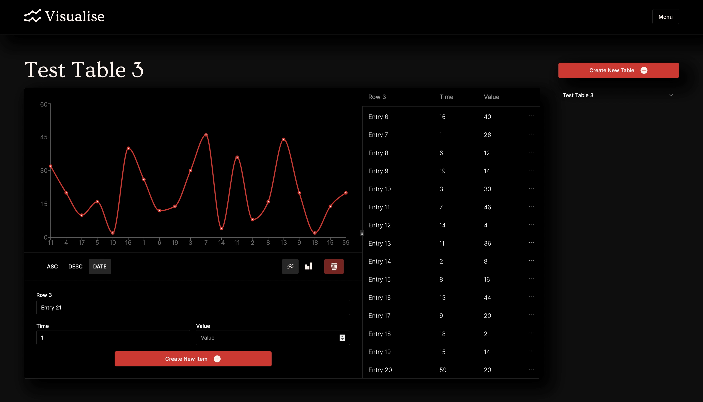

# Visualise
Visualise is a simple data visualisation tool that allowed me the scope to delve deeper into some of the back-end topics that we hadn’t covered in as much depth on the course, including Typescript, building REST API’s in Express/Node and MongoDB, and JWT based authentication. Alongside this I have also been learning Golang and took the opportunity to remake the whole back-end in Go to better understand the language and it’s use case.

